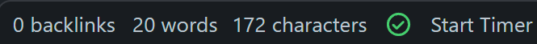

# Simple Timer for Obsidian

A plugin for the Obisidian app that lets you start and stop a timer from the status bar. 
The elapsed time is saved to your Daily Note once the timer is stopped, and the cumulative time tracked for the day is added in as well. 

## Installation
1. Clone this repo or just download the `main.js` and `manifest.json` files
2. Place `main.js` and `manifest.json` in your `YourVaultFolder/.obsidian/plugins/obsidian-timer-plugin` directory
3. Restart Obsidian, and make sure the plugin is enabled in your 'Community Plugins' settings

## Usage
This plugin places a new item in your Obsidian status bar. It defaults to 'Start Timer'.

Once this item is clicked on, a timer starts and the status changes to 'Elapsed Time' with a running time.
When you want to stop the timer, click the item again and the elapsed time is then recorded into your current Daily Note. 
A new Daily Note will be created if you don't already have one for the day. 
The cumulative amount of your timers is also calcuated here and added at the bottom.
